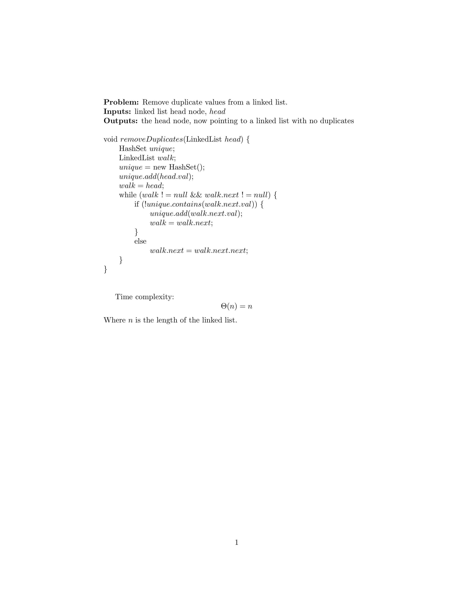

# Remove Duplicates from Linked List
Showcase of a simple algorithm for removing duplicates from a linked list



## Overview
This program operates in a series of steps:
* Randomly generate a linked list.
* Print out the list.
* Remove duplicates from the list.
* Print out the now unique list.

## Analysis

#### Linked List Implementation
The linked list is implemented using a simple class containing an integer value and a pointer to the next node
(initialized to `null`)

A print method is contained in the main class for printing out the linked list, when passed the head node.

#### Duplicate Removal
Duplicate removal is performed by linearly scanning the list with the help of a hash set. Each time an unseen value is
encountered, it is added to the hash set and the walk is advanced to the next element. If a previously seen value is
encountered, the previous node is pointed to the node following the one repeated (walk is not advanced). This continues
until the list end is reached.

## Time Complexity of Duplicate Removal
The time complexity of hash set lookup and add operations is constant, since the underlying data structure is a hash
table, which is known to have constant time complexity for those operations.

Since the list only needs to be searched once to remove all duplicates and hash set operations are constant, the time
complexity of the duplicate removal function is linear with respect to the length of the list.

## Test Cases
The following are some test cases that were generated and run through the duplicate removal algorithm:

```
Generated: 2, 4, 2, 10, 5, 9, 2, 2, 1, 5, 10, 1
Outputted: 2, 4, 10, 5, 9, 1
```

```
Generated: 2, 6, 2, 3, 7, 5, 1, 8, 4, 8, 8, 4, 9, 6
Outputted: 2, 6, 3, 7, 5, 1, 8, 4, 9
```

```
Generated: 3, 2, 6, 5, 7, 5, 4, 3, 5, 2
Outputted: 3, 2, 6, 5, 7, 4
```
